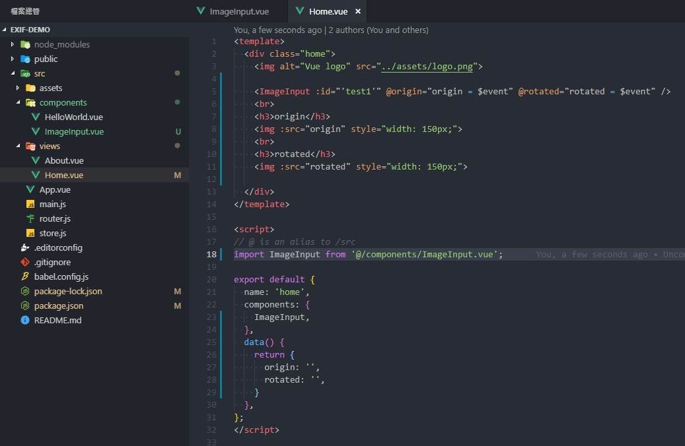

### 相關工具、套件、技術
*node js、 vue-cli 、 vue 、 async/await、 promise、 exif*

### 來源
> *此為觀看 Alex宅幹嘛 youtube直播後的學習紀錄*
> Youtube: [https://www.youtube.com/watch?v=hl_PotclEII&t=27s](https://www.youtube.com/watch?v=hl_PotclEII&t=27s)

### 目的
> 因為圖片擁有一個名為 orientation 的屬性，
> 會使圖片在網頁上因屬性不同而有不同的轉向，
> 所以我們必須透過 exif.js 來將圖片旋轉成對的方向來觀看

### 目錄
* [步驟Step](#步驟Step)
  1. 安裝 Node js
  2. 安裝 Vue-Cli
  3. 新建 Vue 專案
  4. 執行 dev server 確認 Vue-Cli 環境建置是否有問題
  5. 安裝 exif.js
  6. 在 components 資料夾內新增 ImageInput.vue
  7. 在元件內 template 放置 input 元素
  8. 在元件內的 script 引入 exif.js
  9. 在 methods 新增非同步 function
  10. 讀出檔案
  11. 讀出圖片
  12. 讀出 EXIF
  13. 旋轉並轉存成base64
  14. 大功告成
* [心得](#心得)
* [完整程式碼](#完整程式碼)

### [步驟Step](步驟Step)

1. 安裝 Node js
  > [https://nodejs.org/en/](https://nodejs.org/en/)
  ---
2. 安裝 Vue-Cli
   ``` bash
    npm install -g @vue/cli
   ```
   ---
3. 新建vue專案
   ``` bash
    vue create <專案名稱>
   ```
   > vue-cli詢問的安裝選項可以依照需求安裝或暫時都不安裝！
   ---
4. 執行 dev server 確認 vue-cli 環境建置是否有問題
   ``` bash
    npm run serve
   ```
   
   ---
5. 安裝 exif.js
   ``` bash
    npm install exif-js --save
   ```
   ---
6. 在 components 資料夾內新增 ImageInput.vue
   
   ---
7. 在元件內 template 放置 input 元素
   ``` html
    <template>
      <input
        type="file"
        accept="image/*"
        :id="id"
        @change="onFileUpload"
      />
    </template>
   ```
   ---
8. 在元件內的 script 引入 exif.js
   ``` javascript
    import EXIF from 'exif-js'
   ```
   ---
9. 在 methods 新增非同步 function
    ``` javascript
      async onFileUpload(e) {
        const file = e.target.files[0] // 抓出上傳的檔案
        try {
          /*** 程式流程
          *** 從input上傳檔案 -> 讀出圖片 -> 抓出exif -> 放進畫布旋轉後，轉存成base64
          ***/
          let src = await this.loadFile(file) // 讀出檔案內的圖片路徑
          this.$emit('origin', src) // 回傳給父元件原圖路徑
          const img = await this.loadImage(src) // 從路徑讀出圖片
          let exif = await this.loadEXIF(img) // 抓出exif
          if (!exif) {
            exif = 1
          }
          console.log('exif: ', exif)
          if (exif !== 1) {
            const rotatedSrc = this.getBase64(img, exif) // 旋轉後，轉存成base64
            src = rotatedSrc // 旋轉完成的圖片路徑(base64)
          }
          this.$emit('completed', src) // 回傳給父元件結果
        } catch (error) {
          console.log(error)
        }
      }
    ```
    ---
10. 讀出檔案
    ``` javascript
      loadFile(file) {
        return new Promise((resolve, reject) => {
          const reader = new FileReader()
          reader.onload = () => resolve(reader.result)
          reader.onerror = reject
          reader.readAsDataURL(file)
        })
      }
    ```
    ---
11. 讀出圖片
    ``` javascript
      loadImage(src) {
        return new Promise((resolve, reject) => {
          const image = new Image()
          image.onload = () => resolve(image)
          image.onerror = reject
          image.src = src
        })
      }
    ```
    ---
12. 讀出EXIF
    ``` javascript
      loadEXIF(img) {
        return new Promise((resolve, reject) => {
          EXIF.getData(img, function() {
            const tags = EXIF.getAllTags(this)
            const exif = tags.Orientation
            console.log('exif: ', exif)
            resolve(exif)
          })
        })
      }
    ```
    ---
13. 旋轉並轉存成base64
    ``` javascript
      getBase64(img, rotate) {
        const canvas = document.createElement('canvas')
        const ctx = canvas.getContext('2d')
        let { width, height } = img

        let scale = width > height ? 800 / width : 800 / height
        if (scale > 1) {
          scale = 1
        }

        let dw = width * scale
        let dh = height * scale

        canvas.width = rotate > 4 ? dh : dw
        canvas.height = rotate > 4 ? dw : dh

        let x = canvas.width / 2
        let y = canvas.height / 2

        ctx.translate(x, y) // 正中心

        switch (rotate) {
          case 2:
          case 4:
          case 5:
          case 7:
            ctx.scale(-1, 1) // 鏡向
            break
        }
        // 旋轉圖片
        switch (rotate) {
          case 3:
          case 4:
            ctx.rotate(180 * (Math.PI / 180))
            break
          case 5:
          case 6:
            ctx.rotate(90 * (Math.PI / 180))
            break
          case 7:
          case 8:
            ctx.rotate(-90 * (Math.PI / 180))
            break
        }
        if (rotate > 4) { // 寬高互換
          ;[x, y] = [y, x]
        }
        ctx.drawImage(img, -x, -y, dw, dh) // 將旋轉後的圖片畫出來

        return canvas.toDataURL() // 回傳base64
      }
    ```
    ---
14. 大功告成
    > 可以從父元件接收到旋轉後的src放進img內
    > 將圖片顯示出來即可看到旋轉後的結果

    

    > 建議傳 id 進元件內，當作元素識別，避免同時擁有好幾個 input 在畫面時，不知道是哪一個元件

### [心得](#心得)
> 使用電腦時，因為window10有幫我們處理這個問題，所以在電腦上看，是看不出個所以然的！
> 第一次在公司iphone看到圖片上傳後，居然變躺著的...(當時嚇傻了，還以為測試機被我弄壞了)
> 幸好是能透過程式來挽救的(X
> 
> 目前已知會幫忙把圖片自動儲存成正向的手機是 HTC
> 其他牌，例如 Samsung、iphone、Sony的手機都會帶有非1的orientation(就是會旋轉的意思~)

### [完整程式碼](#完整程式碼)

##### Home.vue :
``` javascript
<template>
  <div class="home">
    

    <ImageInput :id="'test1'" @origin="origin = $event" @rotated="rotated = $event" />
    <br>
    <h3>origin</h3>
    
    <br>
    <h3>rotated</h3>
    

  </div>
</template>

<script>
// @ is an alias to /src
import ImageInput from '@/components/ImageInput.vue';

export default {
  name: 'home',
  components: {
    ImageInput,
  },
  data() {
    return {
      origin: '',
      rotated: '',
    }
  },
};
</script>
```

##### ImageInput.vue :
``` javascript
<template>
  <input
    type="file"
    accept="image/*"
    :id="id"
    @change="onFileUpload"
  />
</template>

<script>
import EXIF from 'exif-js'

export default {
  name: 'ImageInput',
  props: {
    id: {
      type: String,
      required: true
    }
  },
  methods: {
    async onFileUpload(e) {
      const file = e.target.files[0] // 抓出上傳的檔案
      try {
        /*** 程式流程
        *** 從input上傳檔案 -> 讀出圖片 -> 抓出exif -> 放進畫布旋轉後，轉存成base64
        ***/
        let src = await this.loadFile(file) // 讀出檔案內的圖片路徑
        this.$emit('origin', src) // 回傳給父元件原圖路徑
        const img = await this.loadImage(src) // 從路徑讀出圖片
        let exif = await this.loadEXIF(img) // 抓出exif
        if (!exif) {
          exif = 1
        }
        console.log('exif: ', exif)
        if (exif !== 1) {
          const rotatedSrc = this.getBase64(img, exif) // 旋轉後，轉存成base64
          src = rotatedSrc // 旋轉完成的圖片路徑(base64)
        }
        this.$emit('completed', src) // 回傳給父元件結果
      } catch (error) {
        console.log(error)
      }
    },
    loadFile(file) {
      return new Promise((resolve, reject) => {
        const reader = new FileReader()
        reader.onload = () => resolve(reader.result)
        reader.onerror = reject
        reader.readAsDataURL(file)
      })
    },
    loadImage(src) {
      return new Promise((resolve, reject) => {
        const image = new Image()
        image.onload = () => resolve(image)
        image.onerror = reject
        image.src = src
      })
    },
    loadEXIF(img) {
      return new Promise((resolve, reject) => {
        EXIF.getData(img, function() {
          const tags = EXIF.getAllTags(this)
          const exif = tags.Orientation
          console.log('exif: ', exif)
          resolve(exif)
        })
      })
    },
    getBase64(img, rotate) {
      const canvas = document.createElement('canvas')
      const ctx = canvas.getContext('2d')
      let { width, height } = img

      let scale = width > height ? 800 / width : 800 / height
      if (scale > 1) {
        scale = 1
      }

      let dw = width * scale
      let dh = height * scale

      canvas.width = rotate > 4 ? dh : dw
      canvas.height = rotate > 4 ? dw : dh

      let x = canvas.width / 2
      let y = canvas.height / 2

      ctx.translate(x, y) // 正中心

      switch (rotate) {
        case 2:
        case 4:
        case 5:
        case 7:
          ctx.scale(-1, 1) // 鏡向
          break
      }
      // 旋轉圖片
      switch (rotate) {
        case 3:
        case 4:
          ctx.rotate(180 * (Math.PI / 180))
          break
        case 5:
        case 6:
          ctx.rotate(90 * (Math.PI / 180))
          break
        case 7:
        case 8:
          ctx.rotate(-90 * (Math.PI / 180))
          break
      }
      if (rotate > 4) { // 寬高互換
        ;[x, y] = [y, x]
      }
      ctx.drawImage(img, -x, -y, dw, dh) // 將旋轉後的圖片畫出來

      return canvas.toDataURL() // 回傳base64
    }
  }
}
</script>
```
