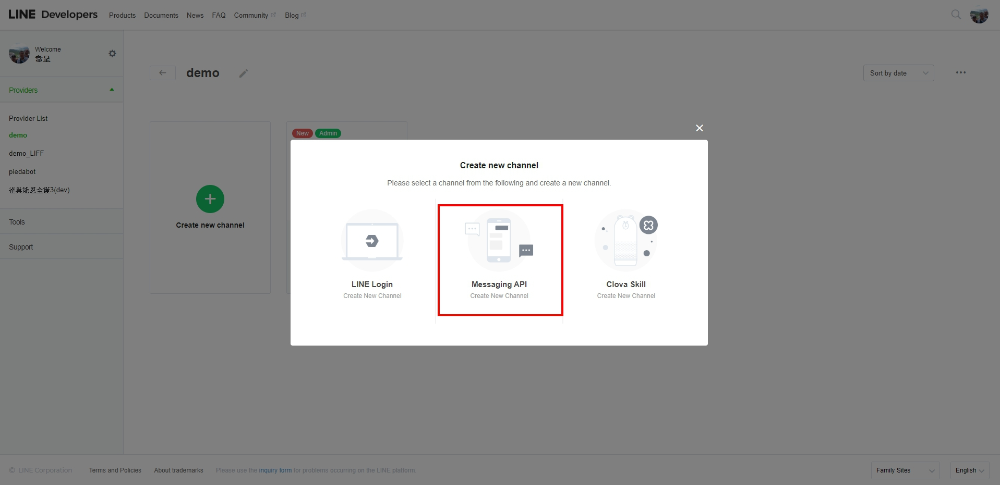
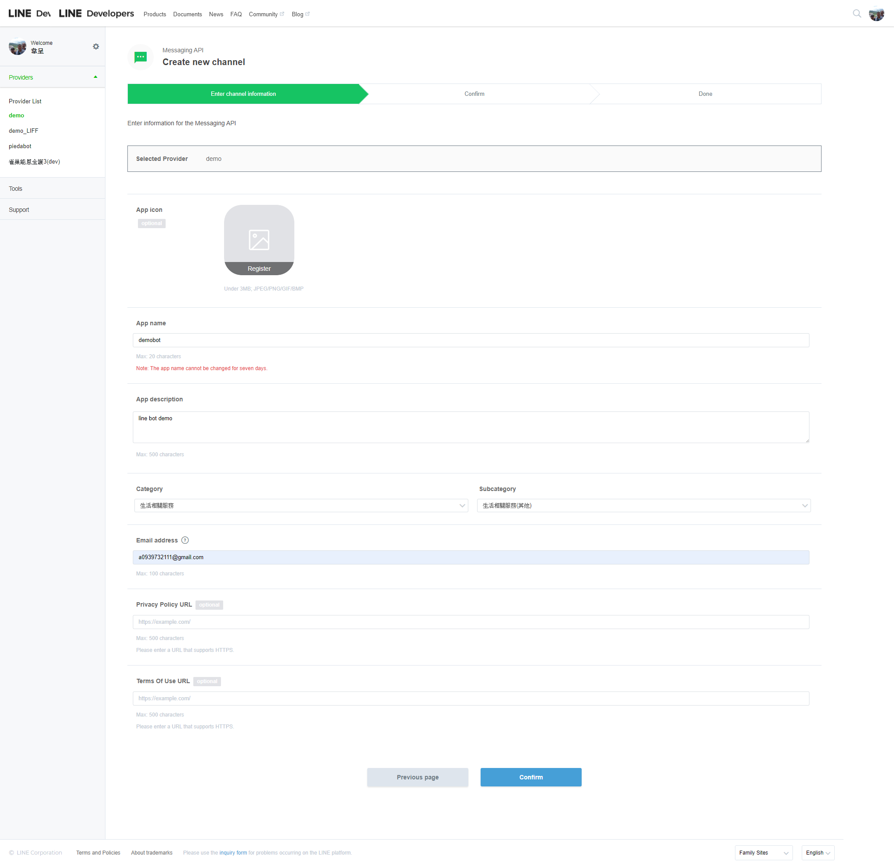
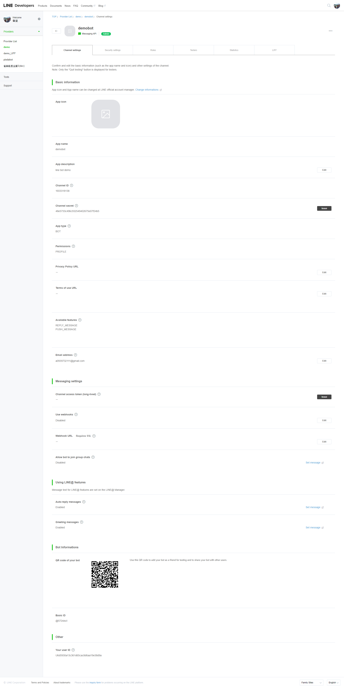
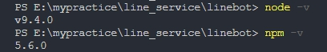
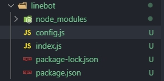
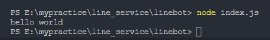

### 相關工具、套件、技術
*Javascript、API、Node JS、LINE Login、LINE Messaging API ( LINE BOT )、 LINE LIFF*

### 目的
> 前面我們已經建立了 LINE 提供的 Login、LIFF 的服務，接下來我們要把這些服務都整合起來，並搭配聊天機器人來給予用戶完整的服務

> 情境為：  
> 1. 會員帳號來自於 LINE 登入 (所以會員都會有綁定 LINE 帳號)  
> 2. 網站有使用 LINE 官方帳號作為訊息通知的服務，且多數會員都會加入此官方帳號

### 步驟
1. 建立 Messaging API 的 channel
   > 
   >> 貼心小提醒： 這個 channel 必須跟我們所建立的 LINE Login 要在同一個 Provider 下，這樣到時候要抓取會員的 userId 才會對得上唷！

   > 接著就照步驟填寫相關資訊
   > 
   > 完成後，就可以看到剛剛所建立的相關資訊
   > 
   >> 下方有個 QR code ，掃描後就可以把自己的機器人加入好友囉
2. 建立製作機器人需要的環境
   > 這邊會需要用到 Node.js
   > 官網傳送門： [https://nodejs.org/en/](https://nodejs.org/en/)
   > 我的本機版本如下：
   > 
   > 小提醒：新手上路的夥伴，版本與我盡量不要差距太大，否則可能會遇到不預期的錯誤唷！
   > 如果擔心未來會需要很常切換 node 的版本，也可以先安裝 nvm (node 版本管理工具)
   > Windows 安裝教學傳送門：[https://oranwind.org/nvm-windows/](https://oranwind.org/nvm-windows/)

   > 接下來，到專案資料夾內或建立一個 linebot 的資料夾，並打開終端機進到該資料夾
   ``` bash
    cd linebot
   ```
   > 初始化專案，產生 package.json
   ``` bash
    npm init

    // 如果懶得回答問題也可以加個參數 (反正之後可以再修改(X
    npm init -y
   ```
   > 安裝需要用到的套件
   ``` bash
    // 建立 Node Server
    npm install express

    // Linebot SDK
    npm install linebot

    // 開發時超好用套件～每次修改完程式，存檔就可以自動重新執行 Node 服務
    npm install nodemon
   ```

   > 接著建立
   > 1. index.js 作為整個 App 的進入點  
   > 2. config.js 放置相關的設定值

   > 目前的檔案結構如下：
   > 

   > 檔案環境都建立好後，我們先來測試有沒有建立成功吧！
   > 到 index.js 內輸入
   ``` js
    console.log("hello world");
   ```

   > 存檔後，用終端機輸入
   ``` bash
    node index.js
   ```

   > 如果有看到 "hello world" 被印出來，就代表成功囉！
   > 

3. 建立機器人的功能
4. 
