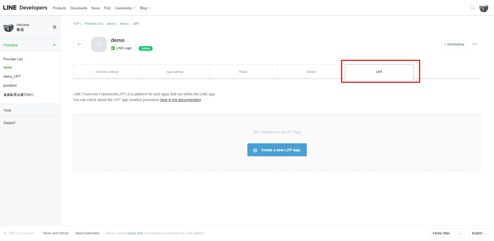
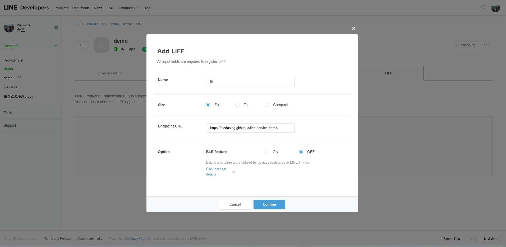
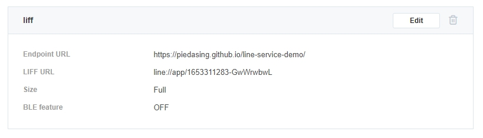

### 相關工具、套件、技術
*Javascript、API、Node JS、LINE Login、LINE Messaging API ( LINE BOT )、 LINE LIFF*

### 目的
> 延續前一篇 LINE Login 的主題，使用 LINE 提供的登入機制後，使得網站設計註冊、登入的流程得以簡化，但還不夠！！  
> 如果網站與 LINE 官方帳號有做連動的話，會員多數會從 LINE 官方帳號點擊選單進到網頁，那會員從點了選單連結後，打開網站還要再按登入才能登入網站，有沒有覺得哪邊怪怪的呢?!  
> 沒錯，既然都使用 LINE 的服務了，那就也把按登入按鈕這一步省略掉吧～

### 步驟
1. 建立 LIFF 服務
   > 延續昨天建立的 LINE Login 的 channel，我們可以看到其實上方 tab 就有一個 LIFF 的名稱
   > 
   > 點選 Create a new LIFF App
   > 
   >> Size 可以設定打開後的畫面要占螢幕多少比例，之後都可以再次編輯～
   >> Endpoint URL 網站的連結 (我目前只有一頁，姑且就先用昨天的 Callback URL 吧)

   > 建立完成後，我們就可以看到我們的 LINE LIFF App 的資訊
   > 
   >> LIFF URL 就是我們要放在 LINE 官方帳號選單上的連結，只能運作在 LINE App 內，從瀏覽器直接點超連結是沒有反應的  
   >> 組成結構為：
   ```
    line://app/{ LINE LIFF id }

    在需要 https 開頭的場合，也可以改用以下連結
    https://line.me/R/app/{ LINE LIFF id }

    LIFF URL 就是一個超連結網址，所以如果頁面有需要帶參數也能用 ? 帶 Query String Parameter
    例如 https://line.me/R/app/{ LINE LIFF id }?id=1
   ```
2. 幫網站加上 LINE LIFF 功能吧～
   > 剛剛已經建立好 LINE LIFF 服務了，接下來就是套用到我們的網站上囉
   > 開啟我們先前建立 LINE Login 的 index.html，並載入 LINE LIFF 的 SDK
   ``` html
    <script src="https://d.line-scdn.net/liff/1.0/sdk.js"></script>
   ```

   > LIFF 使用上也很簡單，只是他只會在 LINE App 內作用，如果直接在一般瀏覽器上使用，結果會變成 undefine
   ``` html
    <script>
        (function (liff) {
            window.onload = function (e) {
                liff.init(function (data) {
                    initializeApp();

                });
            };
            function initializeApp(data) {
                const accessToken = liff.getAccessToken();
            }
        })(liff)
    </script>
   ```
   > 程式只要寫到這邊，你就已經完成 LINE Login 所做的事情了，再來只要將 accessToken 傳給後端 API，就能做會員登入的動作囉

   > index.html 完整程式碼如下：  
   > 也可參考 Demo 網址： [https://piedasing.github.io/line-service-demo/](https://piedasing.github.io/line-service-demo/)
   ``` html
    <!DOCTYPE html>
    <html lang="en">
    <head>
        <meta charset="UTF-8">
        <meta name="viewport" content="width=device-width, initial-scale=1.0">
        <meta http-equiv="X-UA-Compatible" content="ie=edge">
        <title>LINE Login Demo</title>
        <link rel="stylesheet" href="./style.css">
    </head>
    <body>
        <div class="container">
            <a href="javascript:;" id="lineLoginBtn">
                
                
            </a>
        </div>

        <script src='https://cdnjs.cloudflare.com/ajax/libs/jquery/3.4.1/jquery.js'></script>
        <script src="https://d.line-scdn.net/liff/1.0/sdk.js"></script>
        <script>
            (function ($, liff) {
                window.onload = function (e) {
                    liff.init(function (data) {
                        initializeApp();
                    });
                };

                $('#lineLoginBtn').on('click', function(e) {
                    let client_id = '1653311283';
                    let redirect_uri = 'https://piedasing.github.io/line-service-demo/';
                    let link = 'https://access.line.me/oauth2/v2.1/authorize?';
                    link += 'response_type=code';
                    link += '&client_id=' + client_id;
                    link += '&redirect_uri=' + redirect_uri;
                    link += '&state=login';
                    link += '&scope=openid%20profile';
                    window.location.href = link;
                });

                function initializeApp(data) {
                    const accessToken = liff.getAccessToken();
                    // 再將 accessToken 發送給後端 API 處理，就能完成會員登入的動作囉
                }
            })($, liff)
        </script>
    </body>
    </html>
   ```
   > 當然， LIFF 還有很多實用且簡單的 API ，像是 "getProfile"、"sendMessages"，這些都是在應用面相當方便的 API  
   > 詳細請參考 [官方文件](https://developers.line.biz/en/docs/liff/developing-liff-apps/)
3. 小結
   > LINE LIFF 建置過程就是這麼簡單的完成囉～  
   > 接著我們還要再使用 LINE 的 Messaging API 建立聊天機器人，將目前我們所建置的服務統整再一起！
