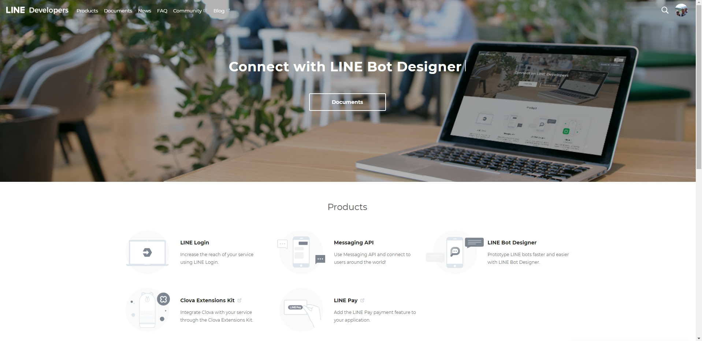
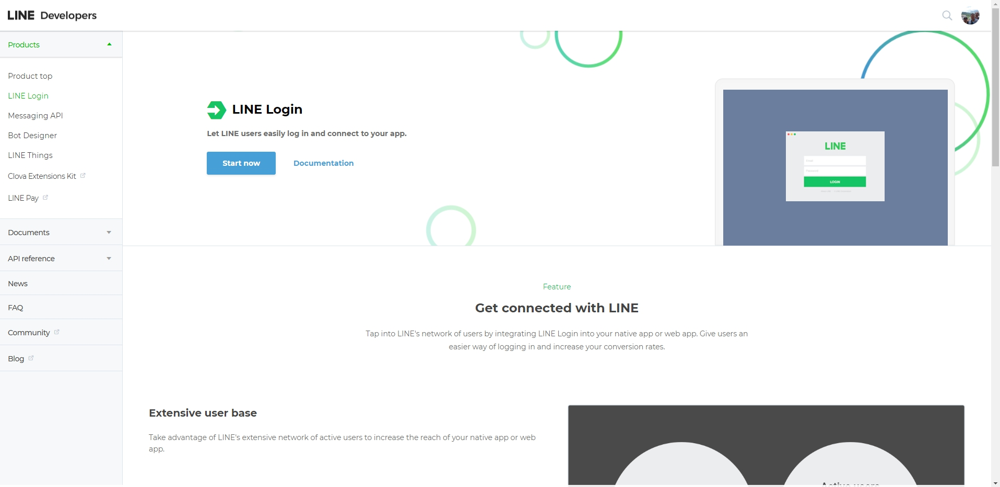
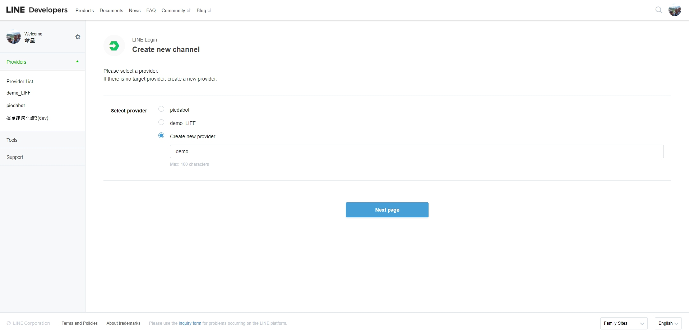
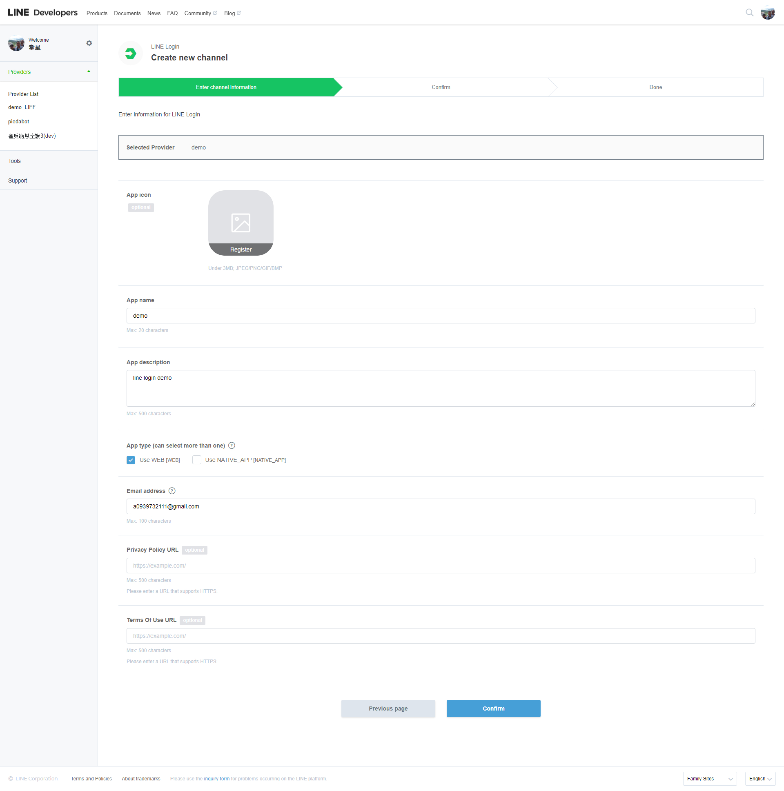
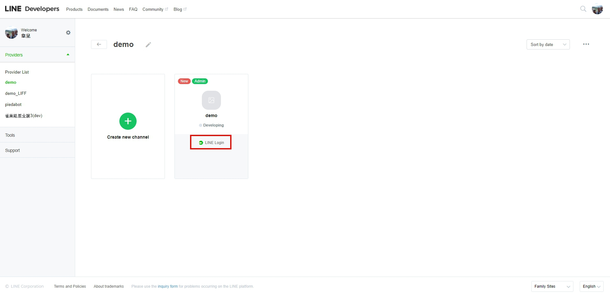
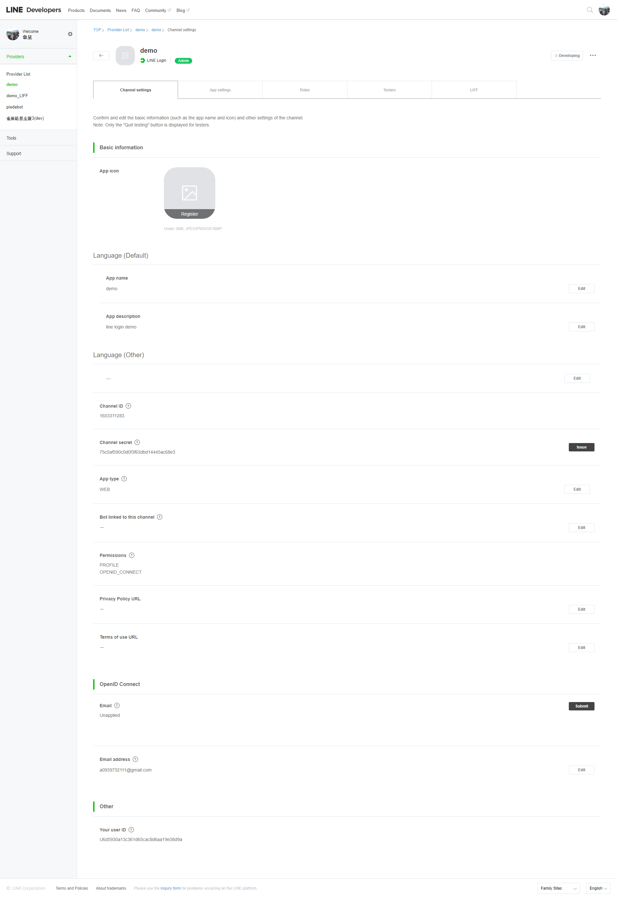
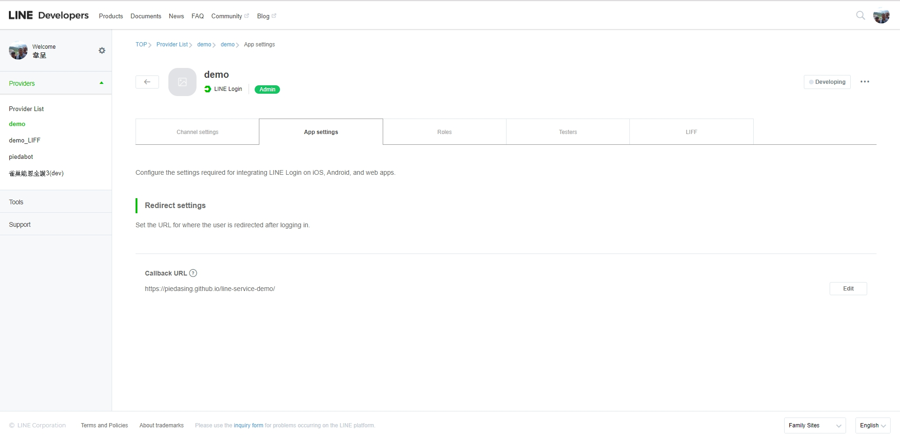
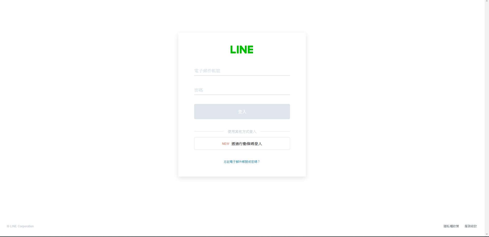
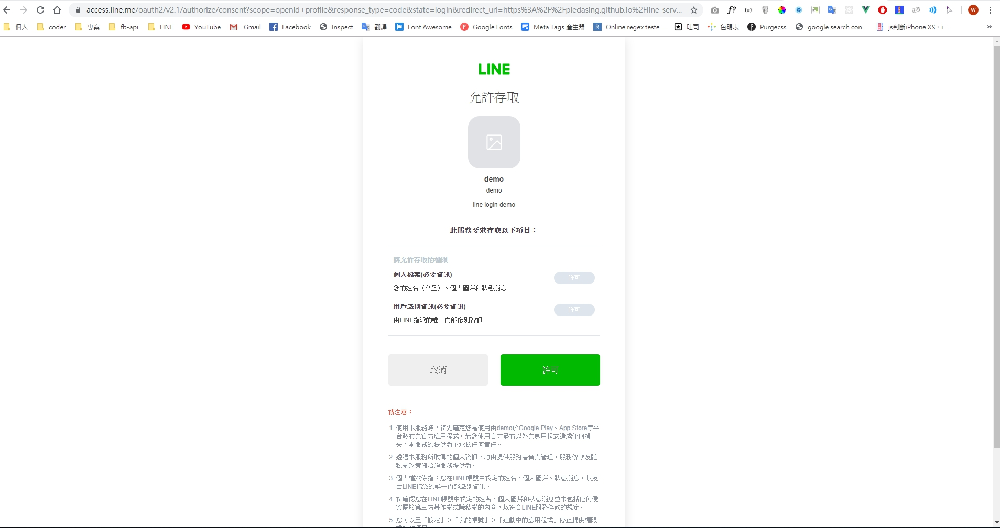
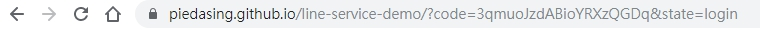

### 相關工具、套件、技術
*Javascript、API、Node JS、LINE Login、LINE Messaging API ( LINE BOT )、 LINE LIFF*

### 目的
> 由於大部分網站都會有會員系統，而成為會員前的步驟 "註冊"，往往成為一個網站容不容易留住該會員的關鍵，過於複雜的註冊流程，容易使 user 不願意繼續填寫完成，就離開網站了。  
> 這時候大家常用的社群軟體就有很棒的出場時機了！像是 Google、LINE、Facebook...等等，他們除了擁有非常廣大的會員之外，也提供了簡單易用的登入機制，能讓我們快速取得會員資料，想註冊的 user 只要按下 "允許" 或是 "以 XXX 身分登入" ，基本上就已經算註冊成為會員了，如此一來可以讓網站的流程變得簡單許多。  
>> 所以這篇部落格目的為：記錄在專案內搭建 LINE 服務過程中的點點滴滴。除了未來有需要再次使用這些服務時，能有一篇統整好的技術文章外，也想幫助正在學習使用的夥伴們，將網路上較凌亂的資料整理成一系列。
>
>> 由於有些功能比較偏向後端，或是已經超出我目前的能力範圍，就不會敘述的那麼詳細囉～

### 步驟
1. 首先要到 LINE Developer 建立一個 LINE 服務 Provider
   > 官網傳送門：[https://developers.line.biz/en/](https://developers.line.biz/en/)

   > 
   > 點選 LINE Login，建立 LINE Login 服務
   > 
   > 選擇 Start Now 後，新增一個 channel
   > 
   >> 貼心小提醒：名稱不能有包含 LINE 的字眼

   > 填入這個 APP 的名稱、描述及信箱，然後 APP Type 要選 Use WEB[WEB]  
   > (其他選填 optional 的欄位可以先跳過)
   > 
   > 建立完成後，就會在 Provider List 中，看到這個 channel
   > 
   > 進到剛剛所建立的 channel 中
   > 
   >> 如果前面建立時的資料有問題，可以在這邊再次編輯  
   >> 沒有問題的話，接下來我們就要開始使用這個服務囉～

2. 開始使用服務
   > 我們可以到 LINE Develops 查看相關的 API 文件
   > 文件傳送門：[LINE Developers 文件](https://developers.line.biz/en/docs/line-login/web/integrate-line-login/)

   > 往下看可以找到如何發送登入的請求
   ```
    https://access.line.me/oauth2/v2.1/authorize
   ```
   > 這支 API ，其實就像是超連結的感覺，簡單說就是我們連過去 LINE 的網站，登入完成後，他會把我們導向回來原本的網站  
   > 但這也是它最關鍵的地方，【redirect_uri】這個參數，如果設錯了， LINE 只會無情的回傳 400 Bad Request 回來

   > 我們先到專案底下，建立一個 index.html 放個按鈕來試試吧，網址上的 Query String Parameter 就依照文件上的指示來放
   ``` html
    <!DOCTYPE html>
    <html lang="en">
    <head>
        <meta charset="UTF-8">
        <meta name="viewport" content="width=device-width, initial-scale=1.0">
        <meta http-equiv="X-UA-Compatible" content="ie=edge">
        <title>LINE Login Demo</title>
    </head>
    <body>
        <button id="lineLoginBtn">LINE 登入</button>

        <script src='https://cdnjs.cloudflare.com/ajax/libs/jquery/3.4.1/jquery.js'></script>
        <script>
            $('#lineLoginBtn').on('click', function(e) {
                let client_id = '1653311283';
                let redirect_uri = 'https://piedasing.github.io/line-service-demo/';
                let link = 'https://access.line.me/oauth2/v2.1/authorize?';
                link += 'response_type=code';
                link += '&client_id=' + client_id;
                link += '&redirect_uri=' + redirect_uri;
                link += '&state=login';
                link += '&scope=openid%20profile';
                window.location.href = link;
            });
        </script>
    </body>
    </html>
   ```
   > 如果覺得按鈕太醜，可以參考文件上的 [LINE Button](https://developers.line.biz/en/docs/line-login/login-button/) 來設計

   > 接著將網頁上傳至 FTP、Github Pages 或 Heroku 等等可以部署網頁的空間  
   >> 如果還不會建立 Github Pages 的話，可以參考六角學院的教學 [https://www.youtube.com/watch?v=njlABvVRB68](https://www.youtube.com/watch?v=njlABvVRB68)

   > 部署完成後，接著我們先回到 LINE Develops 設定頁面設定 Callback URL
   > 
   >> 再次提醒：這個 Callback URL 需與程式碼中的 redirect_uri 相同，否則只會回傳 400 Bad Request

   > 如果成功的話，就可以看到以下畫面：
   > 
   > 登入後會詢問是否允許權限
   > 
   > 按下允許後，就會依照設定的 Callback URL 導向回來網站  
   > 並且網址上會帶上 code 這個參數 (Query String Parameter)
   > 
   >> code 的值其實就是一個 token  
   >> (用來發送其他 LINE API 請求的鑰匙，有時間及次數的使用限制，使用後或過期就失效了)  

   > 我們可以使用這個 token 發送請求給其他的 LINE API (像是取得基本資料 Profile)，就能獲得我們需要的資料  
   > 一般來說，前端只要處理到這邊，把 token 傳給後端，剩下的就交由後端來處理，最後再由後端回傳該會員的 accessToken，這樣就算是完成登入的步驟囉～
3. 小結
   > 在這個 LINE Login 應用中，其實是非常簡單的，幾乎不用寫什麼程式碼，就可以完成登入的動作
   > 在一些案子中，如果使用 LINE 的用戶，是比較居多，或是流程比較順暢的話，就可以考慮不要自建一個登入流程，而是改用 LINE 提供的 Login API ，這樣也會比較省事許多唷～

   > 那麼 Login API 就介紹到這邊囉，接下來我們要進入更有趣的 LINE LIFF 領域
