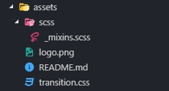
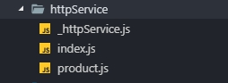
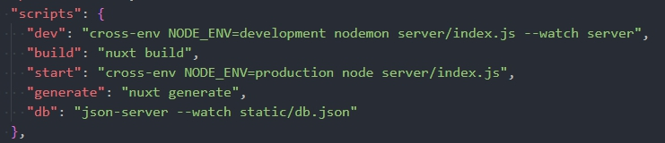

### 相關工具、套件、技術
*Nuxt、Vue、SSR*

### 目的
> 1. 使用 Nuxt ，製作具有 SSR 的簡單電商網頁

### 步驟

1. 新建 nuxt-app 專案
   ``` bash
    npx create-nuxt-app <專案名稱>
   ```
---
2. 安裝套件
   ``` bash
    // 安裝 sass 跟 pug
    npm install node-sass sass-loader pug pug-plain-loader

    // 安裝 json-server
    npm install json-server

    // 安裝 style-resources (在每個.vue檔載入sass/scss檔)
    npm install @nuxtjs/style-resources
   ```
3. 在 assets 資料夾新增樣式
  > 

  > _mixins.scss
  ``` scss
    @mixin size($w, $h: $w) {
      width: $w;
      height: $h;
    }

    @mixin flex($horizontal, $vertial: $horizontal) {
      display: flex;
      justify-content: $horizontal;
      align-items: $vertial;
    }

    @mixin bg($w, $h, $bgSize: contain) {
      @include size($w, $h);
      background-size: $bgSize;
      background-position: center center;
      background-repeat: no-repeat;
    }

    $color-primary: #2C4832;
    $color-secondary: #2C4832;
  ```
  > transition.css
  ``` css
    .page-enter-active, .page-leave-active {
      transition: all 0.5s ease-in-out;
    }
    .page-enter, .page-leave-to {
      transform: rotate(180deg);
      opacity: 0;
    }
    .page-enter-to, .page-leave {
      opacity: 1;
    }

    .icon-enter-active, .icon-leave-active {
      transition: all 0.5s ease-in-out;
    }
    .icon-enter, .icon-leave-to {
      transform: scale(1.5);
      opacity: 0;
    }
    .icon-enter-to, .icon-leave {
      opacity: 1;
    }
  ```
4. 到 nuxt.config.js 載入樣式
  ``` javascript
    head: {
      title: pkg.name,
      meta: [
        { charset: 'utf-8' },
        { name: 'viewport', content: 'width=device-width, initial-scale=1' },
        { hid: 'description', name: 'description', content: pkg.description }
        // 這裡可以新增要放的 meta 資訊
      ],
      link: [
        { rel: 'icon', type: 'image/x-icon', href: '/favicon.ico' },
        // 載入 fontawesome 樣式
        { rel: 'stylesheet', href: 'https://use.fontawesome.com/releases/v5.8.1/css/all.css' },
        // 載入 bootstrap 樣式
        { rel: 'stylesheet', href: 'https://stackpath.bootstrapcdn.com/bootstrap/4.2.1/css/bootstrap.min.css' }
      ]
    },
    css: [
      '~/assets/transition.css' // 載入全域 css 檔
    ],
    modules: [
      // Doc: https://axios.nuxtjs.org/usage
      '@nuxtjs/axios',
      '@nuxtjs/style-resources' // 載入style-resources 模組
    ],
    /*
    ** import sass/scss
    */
    styleResources: {
      scss: [
        '~/assets/scss/_mixins.scss' // style-resources 會在全部的.vue檔載入這支 scss
      ]
    },

  ```
5. 在 pages 資料夾下新增 product.vue
  ``` bash
    <template lang='pug'>
      section.product
        nav
          ol.breadcrumb
            li.breadcrumb-item
              nuxt-link(to="/") 首頁
            li.breadcrumb-item.active 產品
        .container
          .row.w-100
            template(v-for="product in products")
              .col-12.col-md-6.col-lg-4
                Card(:product="product")
    </template>

    <script>
    import Card from '~/components/Card'

    export default {
      name: 'Product',
      components: {
        Card
      },
      data() {
        return {
          products: []
        }
      }
    }
    </script>

    <style lang='scss'>
    .product {
      padding: 1rem 5%;
      nav {
        max-width: 1140px;
        padding-left: 30px;
        padding-right: 30px;
        margin: 0 auto;
      }
      .row{
        margin: 0 auto;
      }
    }
    </style>
  ```
6. 在 components 資料夾下新增 Card.vue
  ``` bash
    <template lang='pug'>
      .card.mb-3
        .img.card-img-top(:style="showImage(product.image)")
          label.feature 本日精選
          transition-group(name="icon")
            i.heart.far.fa-heart(v-if="!isHover" @click="isHover = true" :key="0")
            i.heart.fas.fa-heart(v-else @click="isHover = false" :key="1")
        .card-body
          .card-info
            h6
              span.card-title {{ product.name }}
              span.card-text {{ product.price | currency }}
          a.addToCart.btn.w-100 加入購物車
    </template>

    <script>
    export default {
      name: 'Card',
      props: {
        product: {
          type: Object,
          required: true
        }
      },
      data() {
        return {
          isHover: false
        }
      },
      computed: {
        showImage() {
          return function(url) {
            return { 'background-image': `url('${url}')` }
          }
        }
      },
      filters: {
        currency(num) {
          const n = Number(num)
          return `NT.${n.toFixed(0).replace(/./g, (c, i, a) => {
            const currency = (i && c !== '.' && ((a.length - i) % 3 === 0) ? `, ${c}`.replace(/\s/g, '') : c)
            return currency
          })}元`
        }
      },
      methods: {
      }
    }
    </script>

    <style lang='scss'>
    .card {
      .img {
        @include bg(100%, 200px, cover);
        position: relative;
        .feature {
          background-color: $color-primary;
          color: #FFF;
          writing-mode: vertical-lr;
          padding: 1rem 0.5rem;
          letter-spacing: 5px;
          position: absolute;
          top: -0.5rem;
          left: 1rem;
        }
        .heart {
          display: block;
          background-color: #FFF;
          padding: 0.5rem;
          border-bottom-left-radius: 15px;
          position: absolute;
          top: -1px;
          right: -1px;
        }
      }
      .card-info {
        display: flex;
        margin-bottom: 1rem;
        h6 {
          flex: auto;
          @include flex(center);
          span {
            flex: 1;
            text-align: center;
            margin: 0;
          }
          .card-text {
            border-left: 1px solid $color-primary;
          }
        }
      }
      .addToCart {
        color: $color-secondary;
        background-color: #EAF0ED;
      }
    }
    </style>

  ```
7. 在根目錄新增 httpService 資料夾(存放 api 要用到的資料)
  > 
  > _httpService.js
  ``` javascript
  import axios from 'axios'

  export default function (params) {
    console.log(params)
    const baseURL = 'http://localhost:3000'
    const { method, header, url, path, auth, data } = params
    let headers = {
      'Accept': 'application/json',
      'Content-Type': 'application/json;charset=utf-8',
      ...header
    }
    if (auth) {
      const user = JSON.parse(localStorage.getItem('user'))
      headers = {
        ...headers,
        'Authorization': user ? user.access_token : ''
      }
    }
    console.log(headers)

    return axios({
      method: method || 'get',
      url: url || (baseURL + path),
      withCredentials: true,
      headers,
      data
    })
  }
  ```
  > index.js
  ``` javascript
  import productAPI from './product'

  export {
    productAPI
  }
  ```
  > product.js
  ``` javascript
  import httpService from './_httpService'

  export default {
    getProductList() {
      const path = '/products'
      return httpService({
        method: 'get',
        path
      })
    }
  }
  ```
8. 在 static 資料夾內新增 db.json
  > db.json
  ``` json
  {
    "products": [
      {
        "id": 0,
        "name": "焦糖馬卡龍",
        "price": "450",
        "image": "https://bit.ly/2Dwoxd7"
      },
      {
        "id": 1,
        "name": "焦糖馬卡龍",
        "price": "450",
        "image": "https://bit.ly/2QiWeQW"
      },
      {
        "id": 2,
        "name": "焦糖馬卡龍",
        "price": "450",
        "image": "https://bit.ly/2QbVsVR"
      },
      {
        "id": 3,
        "name": "焦糖馬卡龍",
        "price": "1050",
        "image": "https://bit.ly/2zKOP7w"
      },
      {
        "id": 4,
        "name": "焦糖馬卡龍",
        "price": "450",
        "image": "https://bit.ly/2zL5jN7"
      },
      {
        "id": 5,
        "name": "焦糖馬卡龍",
        "price": "450",
        "image": "https://bit.ly/2NcDVuB"
      },
      {
        "id": 6,
        "name": "焦糖馬卡龍",
        "price": "1050",
        "image": "https://bit.ly/2xPn7Eq"
      },
      {
        "id": 7,
        "name": "焦糖馬卡龍",
        "price": "450",
        "image": "https://bit.ly/2NcDVuB"
      },
      {
        "id": 8,
        "name": "焦糖馬卡龍",
        "price": "450",
        "image": "https://bit.ly/2OUteif"
      }
    ]
  }
  ```
9.  在 package.json 內新增 db 的 npm 指令，並啟用 json-server
  > 
  ``` bash
    // 執行 json-server(監聽 static/db.json)
    npm run db
  ```
10. 呼叫 api
  > 在 product.vue 中 import httpService 內的 function
  ``` js
    import { productAPI } from '~/httpService'
  ```
  > 在 methods 中，新增 getProducts 的 function
  ``` javascript
    getProducts() {
      const { getProductList } = productAPI
      getProductList().then(res => {
        console.log(res)
        if (res.status === 200) {
          this.products = res.data
        }
      })
    }
  ```
  > 在 vue 的生命週期(mounted 或 created 等等)呼叫 getProducts
  ``` javascript
    mounted() {
      this.getProducts()
    }
  ```
11. 發現原始碼與 SPA 一樣，並沒有 SSR
  > 原因是呼叫 api 取得資料的方式，仍為 CSR(Client Side Rendering) ，必須等 js 執行後，才會有畫面上的內容
  > 但是，原始碼依然是空空如也(搜尋引擎爬蟲不執行 js)
12. 調整 api 呼叫方式與使用 asyncData
  > 將 call api 的方式改到 Nuxt 擴充的屬性 asyncData 內執行
  > 透過 async/await 的方式，將資料確實寫入 products 中，nuxt 的 node js server 才會將畫面傳給瀏覽器端顯示
  ``` javascript
    async asyncData({isDev, route, store, env, params, query, req, res, redirect, error}) {
      const { getProductList } = productAPI
      let { data } = await getProductList()
      return {
        products: data
      }
    }
  ```
  > product.vue 最終完整程式碼
  ``` bash
    <template lang='pug'>
      section.product
        nav
          ol.breadcrumb
            li.breadcrumb-item
              nuxt-link(to="/") 首頁
            li.breadcrumb-item.active 產品
        .container
          .row.w-100
            template(v-for="product in products")
              .col-12.col-md-6.col-lg-4
                Card(:product="product")
    </template>

    <script>
    import Card from '~/components/Card'
    import { productAPI } from '~/httpService'

    export default {
      name: 'Product',
      components: {
        Card
      },
      async asyncData({isDev, route, store, env, params, query, req, res, redirect, error}) {
        const { getProductList } = productAPI
        let { data } = await getProductList()
        return {
          products: data
        }
      },
      data() {
        return {
          products: []
        }
      }
    }
    </script>

    <style lang='scss'>
    .product {
      padding: 1rem 5%;
      nav {
        max-width: 1140px;
        padding-left: 30px;
        padding-right: 30px;
        margin: 0 auto;
      }
      .row{
        margin: 0 auto;
      }
    }
    </style>
  ```
13. 心得
  > 這是我接觸 Vue SPA 架構以來，第一次嘗試完成 SSR，原本以為會很困難，但是還好 Nuxt 已經幫我們處理大部分的功能，我們只需要把需要 SSR 的部分，在設定檔或是程式中告訴 Nuxt 就可以輕鬆達成。
  > 
  > 有了 Nuxt，製作 Vue 的專案又多了一個選項，因為 Nuxt 除了能夠幫我們製作 SSR 之外，也能將模式設定成 SPA(幾乎與 Vue-cli 所建立的專案是一樣的)，並且因為 Nuxt 幫我們擴充許多屬性，像是 SSR 需要用到的 head、asyncData 屬性，讓我們可以用原本寫 Vue 的方式，幾乎無痛上手，而且更加方便! 這也是為什麼 Nuxt 最近非常火熱的原因！!!
  > 
