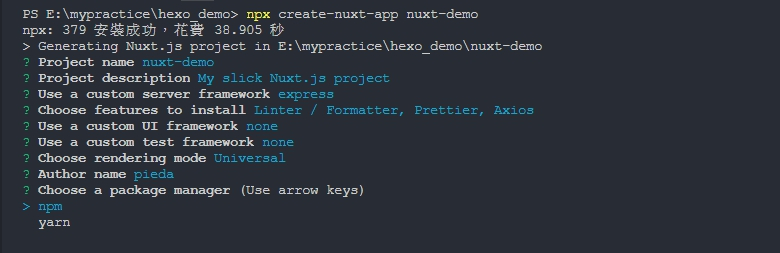
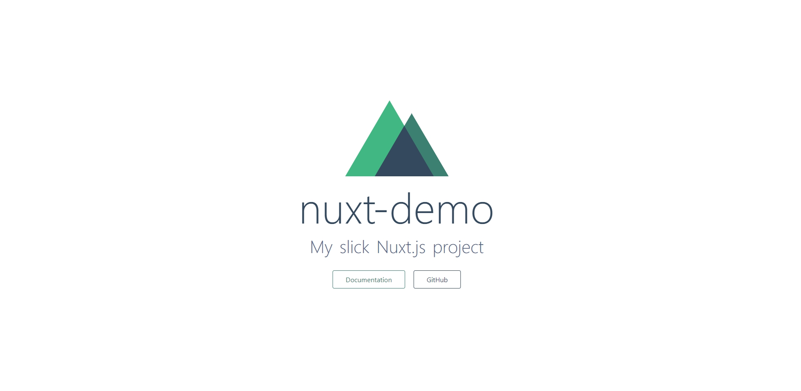
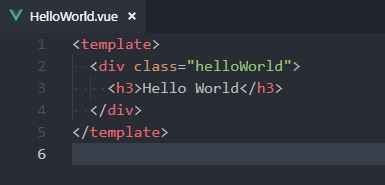
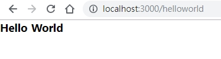

### 相關工具、套件、技術
*Nuxt、Vue、SSR*

### 目的
> 1. 使用 Nuxt 的 universal 模式，製作 SSR 網頁
> 2. 產出原本使用 Vue 製作的 SPA 架構不易製作的 SSR (為了 SEO)
> 3. Nuxt 也可以切換模式為 SPA ，與 vue-cli 腳手架類似，並且觀念幾乎相同

> Nuxt 優點:
> 1. vue-cli有的，Nuxt也有(例如: webpack、babel、熱重載、ESLint、SASS/SCSS)
> 2. 幫我們做 SSR
> 3. 可自訂每個畫面的 Meta
> 4. 路由可以自動產生(vue-cli 需要自己一個一個定義)
> 5. 可以做靜態站

### 步驟

1. 安裝 node js
   > [https://nodejs.org/en/](https://nodejs.org/en/)
---
2. 新建 nuxt-app 專案
   ``` bash
    npx create-nuxt-app <專案名稱>
   ```
   > npm 版本大於 5.2.0 以上才會有 npx
   > npx 安裝完要安裝的套件後，會將它完整移除，讓全域環境保持乾淨！
   > 官網的安裝說明: [https://nuxtjs.org/guide/installation](https://nuxtjs.org/guide/installation)
   > 
---
3. 啟動 server，確認有無問題
   ``` bash
    npm run dev
   ```
   > 
---
4. 專案資料夾結構
   * assets：放需要 webpack 編譯的靜態資源
   * static：放不需要 webpack 編譯的靜態資源
   * pages：放頁面元件
   * components：放可重複利用的元件，例如 Header、Footer
   * nuxt.config.js：Nuxt 的全域設定檔
   * .nuxt：Nuxt 的相關程式碼存放的資料夾
---
5. 開始練習
   * 路由
     1. 新增 HelloWorld.vue
      
     2. 轉眼間，發現...Nuxt 已經幫我們把路由做好了！ so Amazing~~~
      > 切換網址路由進到：`localhost:3000/helloworld`
      >
      > 
      >
      > 原因是 Nuxt 會自動抓 pages 資料夾底下的 .vue檔生成路由
   ---
   * nuxt.config.js
      1. mode：模式
       * universal：產生 SSR，使第一個畫面擁有 SEO 所需要的資料
       * spa：與 vue-cli 所做的單頁式應用程式一樣，產出來的網頁不具有 SEO 需要的資料 
      2. head：網頁的 head 內容
       * title：網頁的名稱
       * meta：可放入搜尋引擎 SEO 所需的資訊
       * link：可放入網頁的小縮圖圖示
       > 在這邊設定是全域的，也可以在個別 page 內設定
      3. loading：網頁載入時的進度條效果
      4. css：可以放共用的css檔，也可以使用 sass/scss
   ---
   * 轉場效果
      預設套用 page 轉場，可自訂 css 效果
      新增`assets/transition.css`
      ``` css
      .page-enter-active, .page-leave-active {
        transition: opacity .5s
      }
      .page-enter, .page-leave-to {
        opacity: 0
      }
      .page-enter-to, .page-leave {
        opacity: 1
      }
      ```
      > 效果設定方式與 Vue 的過渡效果 transition 相同

      接著再到 `nuxt.config.js` 全域載入(也可以個別頁面載入)
      
      ``` javascript
        export default {
          .
          .
          css: ['~/assets/transition.css']
          .
          .
        }
      ```
   ---
   * Nuxt 與 Vue-cli 的頁面元件不同之處
      * Nuxt 擴充了以下屬性
        * head：設定 local 的 head 資訊，可以每頁都不同~
        * layout：套用 layout 資較夾下的布局元件
        * loading：套用的 loading效果、觸發時機
        * transition：頁面轉場效果
        * scrollToTop：換頁後，是否要跳到頁首 
        * asyncData：非同步取得 data 後，存到對應的 data 內
   ---
